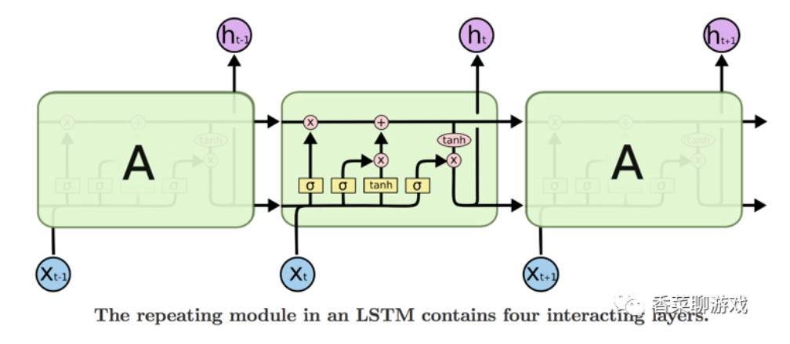

# LSTM、ELMO

# LSTM

**LSTM**（Long Short-Term Memory，长短期记忆网络）是一种改进的**递归神经网络**（RNN），专门设计用来处理和解决 RNN 在学习长序列数据时遇到的**梯度消失**和**梯度爆炸**问题。**LSTM 可以选择性地保留或遗忘信息，捕捉序列中的长期依赖关系**。因此在自然语言处理、语音识别、时间序列预测等任务中有广泛的应用。

## 为什么需要 LSTM？

RNN 在实际应用中会遇到**长期依赖问题**：

- **梯度消失（Vanishing Gradient）**：当序列变长时，反向传播过程中的梯度会越来越小，使得模型难以捕捉长距离依赖关系。
- **梯度爆炸（Exploding Gradient）**：反向传播过程中梯度变得过大，导致模型不稳定。

LSTM 通过设计一个**门控机制**，来选择性地记住或忘记信息，从而解决了传统 RNN 难以捕捉长期依赖的问题。它能够通过控制信息的流动来有效避免梯度消失或爆炸的现象。

## LSTM 的结构

### **记忆单元（Memory Cell）**

记忆单元是LSTM网络的核心，负责在整个序列处理过程中保持和更新长期依赖信息。记忆单元的结构相对简单，主要由一个或多个神经元组成，其状态通过时间步传递，仅通过线性方式更新（如图中三个长方形就代表了记忆单元，x表示输入，h表示输出，后面的C表示记忆的输出）。

### **遗忘门（Forget Gate）**

遗忘门负责决定上一个单元留下来的记忆Ct-1有多少得以保存（控制输入）

现将ht-1和xt拼接成一个一维向量，再进行f=sigmoid(wx+b)的计算得到输出ft（都在0-1之间，表示比例，用于和上一个单元留下的记忆相乘，表示记忆留下的比例）

### **输入门（Input Gate）**

输入门由两部分组成：一个sigmoid层决定输入（ht-1和xt拼成的）哪些值将要更新（得到比例，0-1之间），一个tanh层和遗忘门的sigmoid功能相似，决定有多少输入会留下来（控制输入）

最终记忆的输出结果是上面两步的结果的一个函数，前面一块表示上一个单元的记忆有多少信息要留到记忆里，后面一块表示现在的输入（拼起来的）有多少信息要塞进记忆里

### **输出门（Output Gate）**

输出取决于现在的输入（拼起来的）和更新后的记忆，**sigmoid后的输入乘以 tanh后的记忆**就是这一单元的输出ht，也是下一层要和输入拼起来的输出ht-1

## LSTM 的优点

1. **解决长期依赖问题**：LSTM 能有效保留长距离依赖的信息，避免梯度消失或爆炸。
2. **选择性记忆与遗忘**：通过门控机制，LSTM 能够灵活地选择保留或遗忘哪些信息。
3. **适应复杂序列任务**：LSTM 在处理复杂的时间序列任务、长句子文本、视频帧等任务上表现非常好。

## LSTM 的局限

1. **计算复杂度高**：相比传统的 RNN，LSTM 的计算成本较高，因为每个时间步中有多个门控机制，需要更多的参数和计算资源。
2. **难以捕捉长距离依赖**：虽然 LSTM 能处理一定的长距离依赖，但在非常长的序列中，其性能仍然有限。
3. **序列处理顺序**：LSTM 需要按顺序处理序列，无法像 Transformer 那样并行处理整个序列。

## LSTM 与其他模型的比较

1. **与传统 RNN 比较**：
    
    RNN 存在梯度消失问题，无法处理长序列的依赖关系，而 LSTM 通过门控机制有效解决了这个问题。
    
2. **与 GRU 比较**：
    
    **GRU（Gated Recurrent Unit）** 是 LSTM 的简化版本，具有类似的门控机制，但 GRU 只有两个门（更新门和重置门），计算更简单，适用于某些任务中数据量较少或计算资源有限的场景。
    
3. **与 Transformer 比较**：
    
    LSTM 和 Transformer 是两种不同的序列建模方式。LSTM 通过递归结构逐步处理时间步，而 Transformer 基于自注意力机制可以并行处理整个序列。因此，Transformer 在处理长序列时效率更高，并且能捕捉更远距离的依赖关系。
    

# ELMO

**ELMo** (Embeddings from Language Models) 是一种上下文感知的词嵌入方法，它通过深度双向语言模型（Bidirectional Language Model, BiLM）生成动态的词向量，能够为同一个词**在不同的上下文中生成不同的词向量**，解决了Word2Vec的**词多义性**问题，并能更好地捕捉到句子的语义信息

# ELMo 的架构

ELMo 的架构基于预训练的 **双向 LSTM** 模型，该模型从大规模语料中学习。其核心结构如下：

1. **词嵌入层**：初始输入是词的字符级表示。ELMo 不直接使用独热编码或静态的词嵌入，而是基于字符生成初步的词向量，这让它对未登录词（OOV）有一定的鲁棒性。
2. **双向 LSTM 层**：
    - **左到右 LSTM**：模型读取句子并从左到右生成词的表示。
    - **右到左 LSTM**：模型从右到左读取句子，生成词的另一种表示。
3. **层级组合**：ELMo 最终的词向量由多个 LSTM 层的输出加权组合得到。每一层捕捉不同层次的句法和语义信息（第一层是单词特征，第二层是句法特征，第三层是语义特征）。

# 矩阵计算过程

1、输入层

ELMO的输入是一个句子，其中每个词被表示为一个词嵌入（预训练的静态词向量，如GloVe或Word2Vec）

2、LSTM层（双向）

将LSTM的计算掌握之后这一层的计算就非常好理解，其实就是从前到后，从后到前运行两遍LSTM的计算

3、多层LSTM和权重组合
ELMO的架构通常采用**两层的双向LSTM**（也就是4次LSTM），每一层会有两个输出

总共每个词会有三层的表示（包含输入词向量层）（第一层和第二层的双向LSTM的**输出是直接拼接的**），它们分别是：

4、词向量组合

最后的词表示为：

L是LSTM的层数（一般是2）；ht（l）是第l层的输出，l=0时就是输入xt；sl是第l层的权重；γ是可学习的缩放系数

说白了，就是每一层的输出（第0层就是输入xt）的加权之和再缩小一下

## 优点

1、动态的基于上下文的调整向量，而不在是使用静态固定的向量，解决了一次多义问题

2、使用了双向多层的LSTM可以提取到不同的，更多的句子或者单词的信息

3、在多个NLP的任务当中，得到了或多或少的提升

4、适用面比较广泛，可以用于多个NLP的任务

## 缺点

1、特征提取方面使用到的是LSTM而不是transformer，transformer的特征提取能力远强于LSTM

2、这种**直接采用拼接**的方式，融合双向的信息，并不是最好的方式，目前理论上是这样，但是还没有事实的证明出来这一点。
