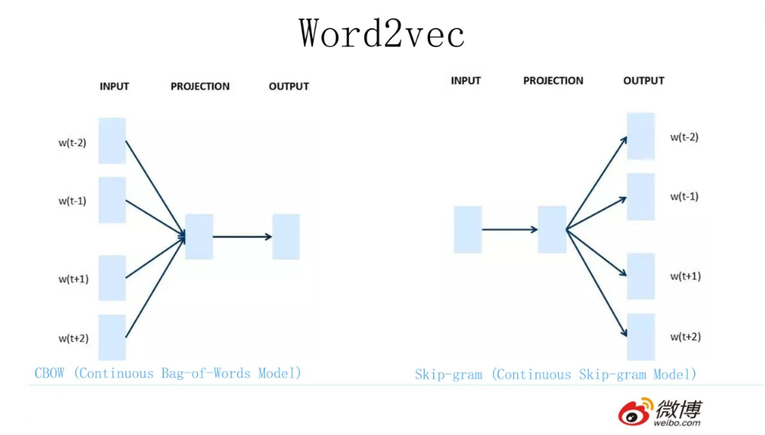

# Word2Vec、GloVe、FastText

# Word2Vec

**Word2Vec的终极目的：得到训练好的输入嵌入矩阵**

Word2Vec 包含两种主要模型：**CBOW (Continuous Bag of Words)** 和 **Skip-gram**，它们是两种不同的训练方法，并不会在同一个模型中一起使用。可以选择使用其中的一种模型进行训练，具体选择取决于你的任务需求和数据特点。

### **CBOW (Continuous Bag of Words)**

- **目标**：通过上下文词来预测中心词。
- **适合场景**：CBOW 更适合大规模数据训练，因为它在每次训练中基于上下文窗口预测中心词，计算效率较高。
- **优点**：相对更快，适合处理大型语料。
- **缺点**：对稀有词的预测效果可能较差。

### **Skip-gram**

- **目标**：通过中心词来预测上下文词。
- **适合场景**：Skip-gram 更适合处理小型语料，尤其是能更好地处理稀有词，因为它更关注一个词的上下文词。
- **优点**：对低频词的效果较好，能更好地捕捉单词的语义。
- **缺点**：计算量较大，训练速度慢于 CBOW。

为了理解整个矩阵计算过程，我们可以以 **Skip-gram** 模型为例，并详细讨论每一步如何通过矩阵运算来实现词嵌入的学习

（Skip-gram模型是输入中心词，输出上下文词的预测）

## 矩阵初始化

首先，我们会有一个初始的输入嵌入矩阵W和输出嵌入矩阵W‘

输入嵌入矩阵用来提取我们输入的中心词对应的词向量，输出嵌入矩阵用来提取输出的上下文词对应的词向量，这两个矩阵就是我们训练的目标，我们需要不断地更新这两个矩阵里的参数

（其中用来乘以嵌入矩阵得到词向量的向量是词的独热编码）

W和W’的大小都是V×D，V是词汇表中词的数量，D是词的维度，初始化都是随机的

## 训练过程

给定一个中心词和其对应的一个上下文词（相当于神经网络里的输入和实际值），训练的目标是最大化中心词和上下文词的相似度，最小化中心词和负样本（随机选择的非上下文词）的相似度

给定了中心词和对应的上下文词以及随机选出的负样本，利用输入嵌入矩阵和输出嵌入矩阵就可以通过向量（独热编码）×矩阵分别在两个矩阵中提取出对应的词向量（负样本的词向量也要在输出嵌入矩阵中提取）

将中心词分别与其对应的上下文词和负样本的词向量进行点积，就可以得到两个相似度（训练的目的就是让前者变大，而后者变小），将相似度都使用负样本的损失函数（可以理解为一种简单的softmax）来让其缩在0-1之间，相似度越大就越靠近1，相似度越小就越靠近0，所以我们目的就是通过sigmoid函数让点积的结果（相似度）前者（与上下文词的）更靠近1，而后者（与负样本的）更靠近0

（负采样：由于词汇表通常非常大，计算所有词的 softmax 非常耗时，因此 Word2Vec 使用了**负采样**。负采样从词汇表中随机选择一些不在上下文中的词作为负样本）

算出损失函数之后，利用反向传播和梯度下降的思想，反向更新W和W‘里面的参数（里面的所有值都是参数），最后得到更新多次后的两个矩阵W和W’，这就是**Word2Vec的终极目的—得到两个训练好的嵌入矩阵**

更新的公式：（很熟悉的反向传播的梯度计算和梯度下降的公式）

在模型训练结束后，输入嵌入矩阵W 和输出嵌入矩阵W′ 中的每一行向量就代表了每个单词的最终嵌入向量。通常我们只使用输入嵌入矩阵W 来作为单词的词向量。

这样**预训练语言模型**就出来了，我们先使用独热编码在Word2Vec训练好的嵌入矩阵中直接得到词向量，然后利用词向量来进行下游任务。

# GloVe

GloVe（**Global Vectors for Word Representation**）是由斯坦福大学的研究团队在2014年提出的一种用于生成词向量的模型。与Word2Vec不同，GloVe基于**词共现矩阵**进行训练，捕捉了整个语料中词与词之间的全局统计信息，从而生成高质量的词嵌入。这些词嵌入能够表示词语的语义，且在一定程度上可以处理词语之间的相似性、类比关系等。

## 基本思想

GloVe模型的核心思想是：**词语的语义相似性可以通过它们在不同上下文中的共现频率来捕捉**。如果两个词经常出现在相似的上下文中，那么它们在向量空间中的表示应该是相近的。

## 训练步骤

GloVe的输入是一份大型语料库，比如Wikipedia、新闻数据等。在处理语料时，GloVe会统计词语的**共现频率**。这个共现频率是通过定义一个固定大小的**滑动窗口**来确定的，这个窗口大小决定了在计算单词共现频率时考虑的**上下文范围**（例如，如果窗口大小为5，那么对于句子中的每个词，都会考虑其前后各2个词（共5个词）作为上下文来统计共现频率‌）。

然后，GloVe会为整个语料库构建一个**词共现矩阵**X，矩阵中的元素Xij 表示词i 和词j 在固定窗口内**共同出现的次数**。

假设有一个简单的文本：

I like deep learning. I like NLP and deep learning.

词汇表V={I,like,deep,learning,NLP,and}，共现窗口为2（这说明我们只需要看相邻的两个词的共现频率，看一次就往后滑一格）

**共现矩阵**如下：

|  | I | like | deep | learning | NLP | and |
| --- | --- | --- | --- | --- | --- | --- |
| **I** | 0 | 2 | 0 | 0 | 0 | 0 |
| **like** | 2 | 0 | 1 | 1 | 1 | 0 |
| **deep** | 0 | 1 | 0 | 2 | 0 | 1 |
| **learning** | 0 | 1 | 2 | 0 | 0 | 1 |
| **NLP** | 0 | 1 | 0 | 0 | 0 | 1 |
| **and** | 0 | 0 | 1 | 1 | 1 | 0 |

但这仅仅只是一个工具，并不是我们要的东西

GloVe的**目标**是让词向量之间的关系能够与词的共现概率相关。假设词i 和词j 之间的共现概率为P(i∣j)，GloVe尝试找到一个函数，使得两个词的词向量间的**差异**能够反映这种**概率**关系：

- wi​、wj​、wk​ 是词的向量表示；
- P(i∣k)表示词 i 在上下文中出现给定词 k 的概率；
- 通过这种关系，GloVe模型试图找到一个函数 f 来反映词与词向量之间的几何关系。

**解释：**这里的P(i|k)和P(j|k)是已知的，然后wi、wj和wk也都是已知的，我们要求的是f这个函数

k是上下文词，简单来说，看两个词的相似度，就是看两个词与上下文词出现的频率是不是差不多（比如，我要判断苹果和香蕉是不是相似的，可以从“我吃苹果”和“我吃香蕉”这个上下文词“我吃”来入手，想一想，是不是和“我吃”经常一起的词都是食物，这个与“我吃”共现频率比较大的词就和苹果香蕉的相似度就比较大，因为都是食物嘛）

为了简化模型，GloVe通过一系列数学推导，将这个问题转换为最小化以下损失函数：

- Xij​ 是词 i 和词 j 之间的共现次数；
- f(Xij)是权重函数，用于降低低频词的影响（通常设为 f(x)=min(x,1)）；
- wi、wj 分别是词 i 和词 j 的向量表示；
- bi、bj 是偏置项。

**解释：**这样通过最小化损失函数来训练一个映射关系（词向量表示和实际共现次数的映射），要记住我们的目的只是为了建立一个好的函数，使得词向量的差异和它们的共现频率可以转换（从一开始目的上看，我们根本不需要引入上下文词k，引入只是为了在语义上更好理解），所以在简化过程中上下文词k就没了，因为它只是一个用于过渡的变量

中间的推导过程就省略了，只要知道是推导出的就可以了，然后来理解一下损失函数：这里面的已知的是Xij和f函数，参数是wi、wj、bi、bj，我们的目的就是利用反向传播和梯度下降不断更新这四个参数，理解了反向传播和梯度下降算法应该知道是什么流程

f(Xij​) 是一个加权函数，用于降低低频共现对模型的影响，通常设置为：

最后，GloVe会得到训练好的**每个词**的词**向量wi**和**上下文词向量wj**（也相当于获得Word2Vec里的输入嵌入矩阵和输出嵌入矩阵，和Word2Vec的效果一样）

## Word2Vec和GloVe的区别和联系

1、Word2Vec只考虑局部的上下文信息，而GloVe基于全局统计信息，依赖共现矩阵建模；

2、Word2Vec的词语义单一，而GloVe能够捕捉更多全局的语义关系

3、对于小语料库，Word2Vec可能表现更好，因为它擅长局部上下文信息；对于大语料库，GloVe可能更有优势，尤其是能够捕捉更丰富的语义关系

# FastText

**FastText** 是由 Facebook 的研究团队提出的一种改进的词嵌入模型，它的主要贡献在于将**词作为子词的组合**来表示，从而解决了传统词嵌入模型（如 Word2Vec、GloVe）在处理**未登录词**（out-of-vocabulary, OOV）时的局限性，同时提高了对词形变化（如复数、词缀等）的敏感性。

## 1. 背景与动机

传统的词嵌入模型（如 Word2Vec 和 GloVe）为每个词生成一个独立的词向量表示，而这些词向量是基于语料库中每个词的全局上下文进行训练的。因此，这些模型的效果较好，但它们有几个问题：

1. **未登录词问题（OOV）**：当模型遇到训练语料中没有出现的词时，它无法生成合适的词向量。比如说，一个新的复合词或拼写错误的词，在没有相应的词向量时，模型无法处理这些词。
2. **对词形变化不敏感**：像词的复数形式、词缀变化等，可能会被视为不同的词，导致冗余词向量。
3. **数据稀疏问题**：对于低频词，传统模型无法很好地学习到它们的语义表示，因为训练数据中它们的上下文信息较少。

**FastText** 通过将词分解为**子词**（subword）或**字符 n-gram** 的方式，解决了这些问题。

## 2. FastText 的核心思想

FastText 的核心思想是将每个词看作多个子词（subword）的组合，这些子词可以是字符 n-gram（字符序列），从而模型不仅能为一个词生成向量，还能为子词生成向量。这样，即便模型遇到未登录词，它也可以通过这些子词的组合来构造一个合理的词向量。

简单来说，FastText可以看作是先把词分成子词，然后基于这些子词生成词的表示，并通过类似于Skip-gram的方式进行上下文词预测